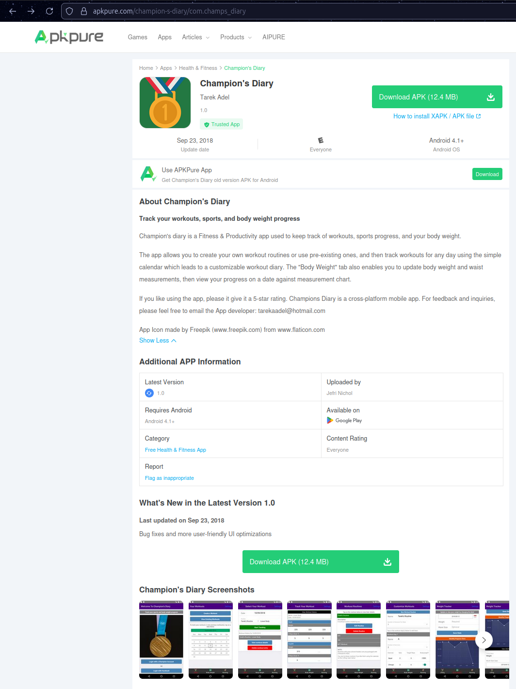

# Champion's Diary: Cross-Platform Mobile App

  

  <strong>A fitness tracking app for workout & gym enthusiasts</strong> 
  Built with React Native • Redux • Firebase Authentication • Cloud Firestore

---

Champion's Diary is a free cross-platform mobile app for iOS and Android. It allows you to easily track progress for fitness workouts & body weight.

**Android Download Link**: [Play Store](https://apkpure.com/champion-s-diary/com.champs_diary)  
**iPhone Download Link**: No longer available (expired App Store subscription)

---

## Screenshots (Android)

### Home & Calendar

  
  

### Workout Tracking

  
  

### Workout Routines & Customization

  
  

### Weight Tracker

  
  

