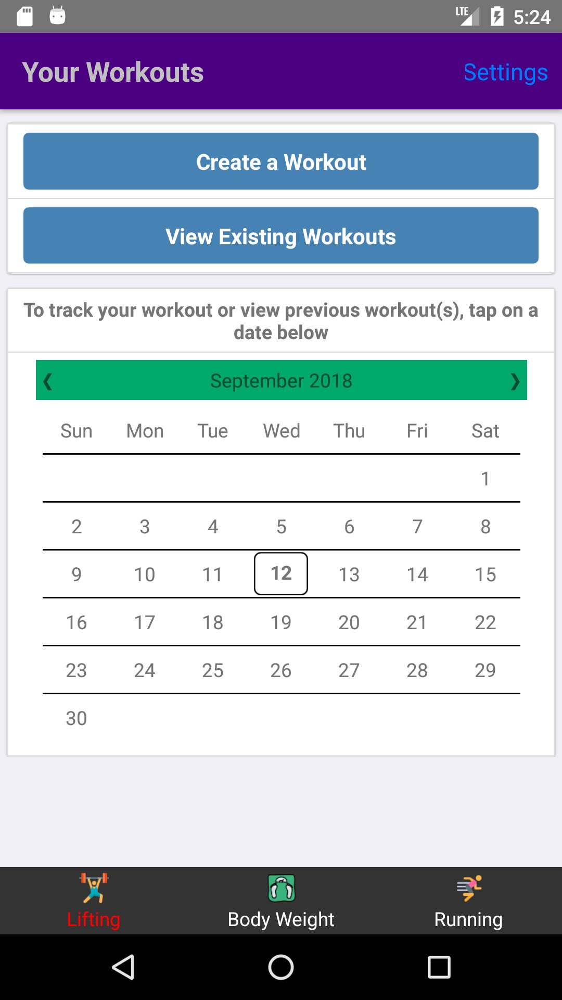
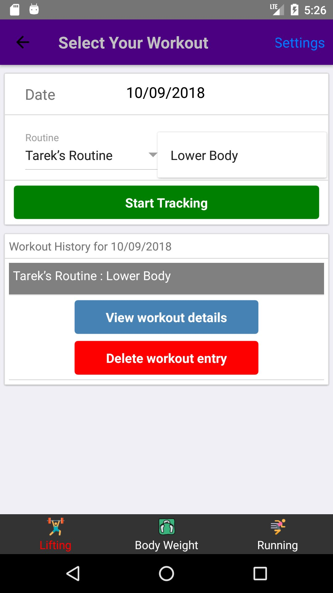
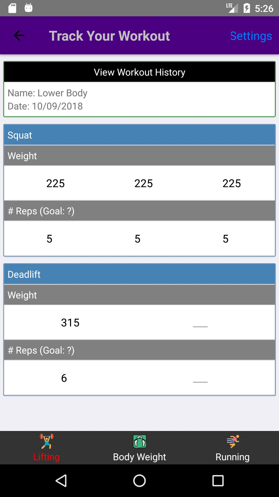
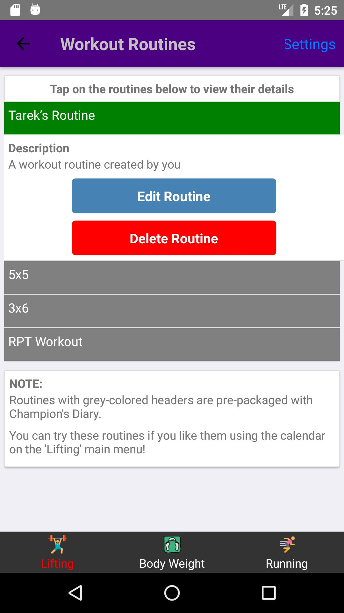
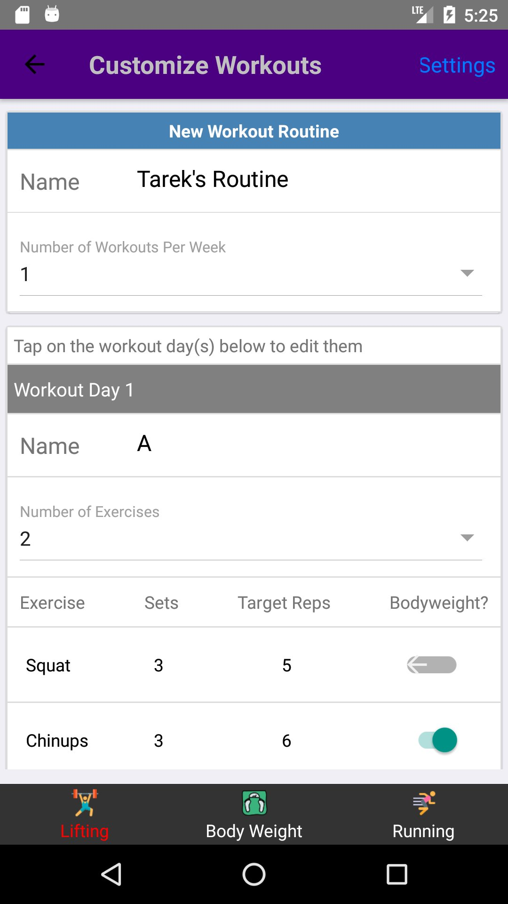
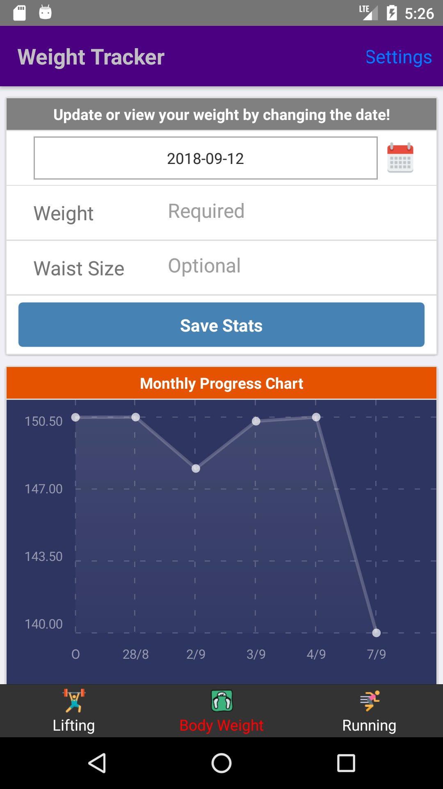
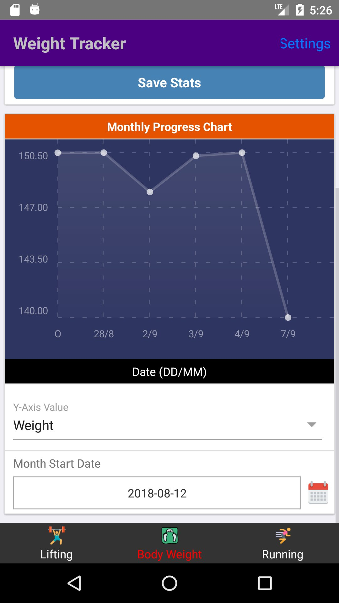

<h1 align="center">Champion's Diary: Cross-Platform Mobile App</h1>

<p align="center">
  
</p>

<p align="center">
  <strong>A fitness tracking app for workout & gym enthusiasts</strong><br/>
  Built with React Frontend & Firebase Backend
</p>

<p align="center">
  
  
  
  
  
</p>

---

Champion's Diary is a free mobile app for iOS and Android. It allows you to easily track progress for fitness workouts & body weight.

**Android Download Link**: [https://apkpure.com/champion-s-diary/com.champs_diary](https://apkpure.com/champion-s-diary/com.champs_diary) <br/>
**iPhone Download Link**: No longer available (expired App Store subscription)

---

## 📱 Screenshots (Android)

### Home & Calendar
<p align="center">
  
  
</p>

### Workout Tracking
<p align="center">
  
  
</p>

### Workout Routines & Customization
<p align="center">
  
  
</p>

### Weight Tracker
<p align="center">
  
  
</p>

---

## ✨ Features

- **📅 Calendar-Based Workout Logging** — View and track workouts on a day-by-day basis with an interactive calendar
- **🏋️ Customizable Workout Routines** — Create, edit, and organize personalized workout routines with exercises and sets
- **📊 Weight Tracking & Charts** — Monitor body weight over time with visual SVG charts
- **🔄 Offline Support** — Redux Persist enables full offline functionality with automatic cloud sync
- **🔐 Secure Authentication** — Firebase Authentication for secure user accounts
- **☁️ Cloud Storage** — Firestore database keeps workout data synced across devices

---

## 🛠️ Tech Stack

| Category | Technologies |
|----------|-------------|
| **Framework** | React Native |
| **State Management** | Redux, Redux Thunk, Redux Persist |
| **Backend** | Firebase Authentication, Cloud Firestore |
| **Navigation** | React Native Router Flux |
| **Data Visualization** | react-native-chart-kit, react-native-svg-charts |
| **Date Handling** | Moment.js, react-native-calendar-datepicker |

---

## 🏗️ Architecture

```
src/
├── actions/          # Redux action creators
│   ├── AuthActions.js
│   ├── WorkoutActions.js
│   ├── WeightActions.js
│   └── ...
├── reducers/         # Redux reducers
│   ├── AuthReducer.js
│   ├── WorkoutReducer.js
│   ├── WeightReducer.js
│   └── ...
├── components/
│   ├── common/       # Reusable UI components
│   ├── Lifting/      # Workout tracking screens
│   ├── WeightCharts/ # Weight tracking & visualization
│   ├── Running/      # Running tracker
│   └── ...
├── App.js            # Redux store setup & persistence
└── Router.js         # Navigation configuration
```

**Key Technical Decisions:**

- **Redux Persist** for offline-first architecture — users can log workouts without internet connectivity
- **Firestore** for real-time sync and scalable NoSQL document storage
- **Component-based routing** with React Native Router Flux for clean navigation patterns
- **Modular reducer structure** for maintainable state management
